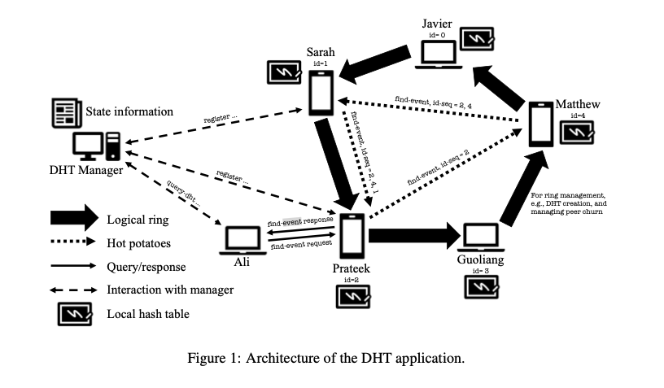

# CSE434 Socket Programming Project: DHT Application

**Submit the project in a zip file named `Group<group_number>.zip**

**No late submission is accepted**

📆 Available: `Sunday 02/26/2025`

📆 Midestone due: `Sunday 03/23/2025`

📆 Full project due: `Friday 04/04/2025`

📌 Documentation: [Documentation](https://docs.google.com/document/d/1zdzy2W98iVG3k-rULQHCNX07EMCQG1knNZorXkv003U/edit?tab=t.0)  
📌 Design Doc: [CSE434: Socket Project](https://docs.google.com/document/d/1zIXYn8LTUxaovb8iLyP6x7aYPeaWQDtc4o6muHAUQH4/edit?tab=t.0#heading=h.mz71e5s6w1lg)  
📌 Time-space Diagram: [Time-space Diagram](https://docs.google.com/presentation/d/1ufCHWC4uRkZ89WrBdrQZOXyu7C4mGx7TVxSi8UaxVyE/edit#slide=id.p)  
📌 Video Demo: (TBD)  

## Architecture ⚙️

- Written in `Python`
- Version Control: `git` + `github`
- Dependecies: check `requirements.txt`



## Environment Setup 💻

Make sure you have [Python](https://www.python.org/downloads/) and [pip](https://pip.pypa.io/en/stable/installation/) installed on your local machine.

```
cd dht-application
python -m venv venv # create virtual enviroment
source venv/bin/activate # mac
venv\Scripts\activate # window
pip install -r requirements.txt # install dependecies
pip list # check if all dependecies are properly installed
```

## Run the program 🏋️‍♀️

### DHT Manager (`dht_manager.py`)

```
# python3 dht_manager.py <port>
python3 dht_manager.py 12345
```

### Peers (`dht_peer.py`)

(Can have multiple instances running)

```
# python3 dht_peer.py <manager_ip> <manager_port>

python3 dht_peer.py localhost 12345

```

## Milestone Submission 📑

For the milestone deadline, you are to implement the following commands to the manager: `register`, `setup-dht`,
and `dht-complete`. This also involves implementation of commands that may be issued among peers associated
with these commands.

- [x] register
- [x] setup-dht
- [x] dht-complete

1. Design document in PDF format (50%). Describe the design of your DHT application pro

- [ ] Include a description of your message format for each command implemented for the miles
- [ ] Include a time-space diagram for each command implemented to illustrate the order of messages exchanged between communicating entities, as well as the actions taken on the transmission and/or receipt of a message or other event.
- [ ] Describe your choice of data structures used, implementation considerations, and other design decisions.
- [ ] Include a snapshot showing commits made in your choice of version control system.
- [ ] Provide a a link to your video demo and ensure that the link is accessible to our graders. In addition, give
      a list of timestamps in your video at which each step 3(a)-3(d) is demonstrated.

2. [x] Code and documentation (25%). Submit your well-documented source code implementing the milestone of
   your DHT application.

3. Video demo (25%). Upload a video of length at most 7 minutes to YouTube with no splicing or edits, with audio
   accompaniment. This video must be uploaded and timestamped before the milestone submission deadline.The video demo of your DHT application for the milestone must include:

- [ ] Compile your manager and peer programs (if applicable)
- [ ] Run the freshly compiled programs on at least two distinct end-hosts
- [ ] Start your manager program. Then start three peer processes that each register with the mananger
- [ ] Have one peer issue a setup-dht command to build a DHT of size n = 3 using the YYYY = 1950
      dataset. This should output the number of records stored at each peer in the ring and finish by sending a
      dht-complete to the manager.

- [x] For the end-hosts, consider using general{3|4|5}.asu.edu, the machines on the racks in BYENG 217, or
installing your application on VMs on a LAN you configure in CloudLab, or using any other end-hosts available
to you for the demo. (We use AWS EC2)

Your video will require at least four (4) windows open: one for the manager, and one for each peer. Ensure
that the font size in each window is large enough to read!

Be sure that the output of your commands are a well-labelled trace of the messages transmitted and
received between processes so that it is easy to follow what is happening in your DHT application program.

**_Refer to the pdf for the detailed versions_**

**_Graceful termination of your application is not required at this time._**


## Reproduce Milestone 🎯

This is step by step on reproducing milestone.

### Initialize DHT Manager Program

In your local computer, run:
```
python3 dht_manager.py 12345
```

or 

For milestone, connect to your EC2 instance since we need to run the program on 2 distinct end hosts: 
```
ssh -i <your_pem_key> <your_EC2_public_IP> # SSH into your EC2 Instance 
git clone https://github.com/LuaanNguyen/DHT-application.git
cd DHT-application
```

If your EC2 distro is debian, you can run these commands to install neccessary depedencies:
```
sudo apt install python3
python3 -m venv venv
source venv/bin/activate # For Linux/Debian
pip install -r requirements.txt
python3 dht_manager.py 12345
```

### Initialize Peer Program

In your local computer, on 3 different terminal windows, run reach peer with the same port as manager (`12345` in this case):
```
python3 dht_peer localhost 12345
```

### Register each peer

```
# terminal 1
register peer1 127.0.0.1 8001 8002

# terminal 2
register peer2 127.0.0.1 8003 8004

# terminal 3
register peer3 127.0.0.1 8005 8006
```

### Set up DHT

Peer1 sends `setup-dht` to the manager. The manager then proceeds to check and peer1 is now able to set up the ring by communicating with other peers.

```
# terminal 1
setup-dht peer1 3 1950
```

If everything works correctly, you'll see logs in the manager showing the DHT setup process and completion.

### DHT complete

```
# terminal 1
dht-complete peer1
```

You should see a receipt ("SUCCESS") of a dht-complete indicates that the leader has completed all the steps required to set up the DHT.

## TO DOS for Final Submmission (TBD)
